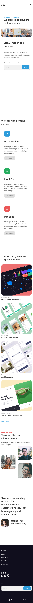

<!-- Please update value in the {}  -->

<h1 align="center">Edie HomePage</h1>

<div align="center">
   Solution for a challenge from  <a href="http://devchallenges.io" target="_blank">Devchallenges.io</a>.
</div>

<div align="center">
  <h3>
    <a href="https://devs.natal.br/devchallenges/edie-homepage-master">
      Demo
    </a>
    <span> | </span>
    <a href="https://github.com/joabalves-dev/devchallenges-edie-homePage">
      Solution
    </a>
    <span> | </span>
    <a href="https://devchallenges.io/challenges/xobQBuf8zWWmiYMIAZe0">
      Challenge
    </a>
  </h3>
</div>

<!-- TABLE OF CONTENTS -->

## Table of Contents

- [Overview](#overview)
  - [Built With](#built-with)
- [Features](#features)
- [How to use](#how-to-use)
- [Contact](#contact)
- [Acknowledgements](#acknowledgements)

<!-- OVERVIEW -->

## Overview
### Screenshot descktop 

### Screenshot Mobile 



## How To Use

<!-- Example: -->

To clone and run this application, you'll need [Git](https://git-scm.com) and [Node.js](https://nodejs.org/en/download/) (which comes with [npm](http://npmjs.com)) installed on your computer. From your command line:

```bash
# Clone this repository
$ git clone https://github.com/joabalves-dev/devchallenges-edie-homePage

```

## Contact

- Website [devs.natal.br](https://devs.natal.br)
- GitHub [@joabalves-dev](https://github.com/joabalves-dev/)
